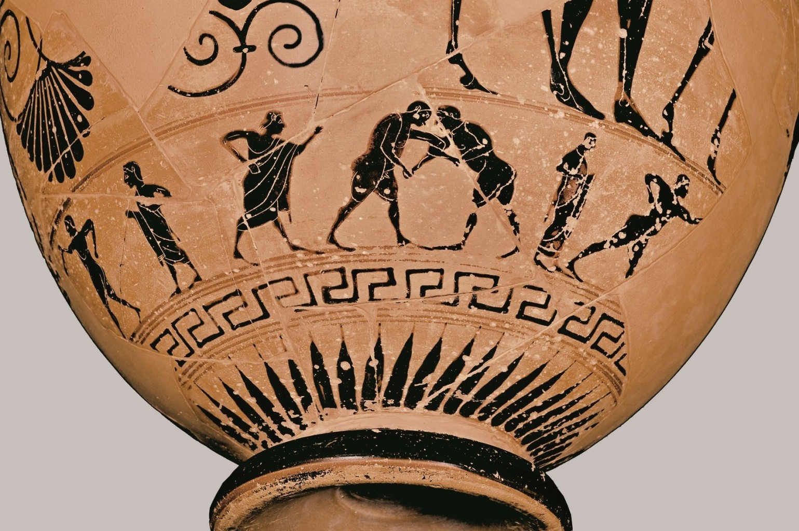

# sundaypython

Input session for Coding da Vinci Ost 2018: Python 101 for data processing.

> Coding da Vinci, der Kulturhackathon, vernetzt die Kultur- und Technikwelt
miteinander und zeigt, welche überraschenden Möglichkeiten in offenen
Kulturdaten stecken. -- https://codingdavinci.de/

* [Slides](Slides.md) - [PDF](Slides.pdf)

## Data

* https://codingdavinci.de/daten/

Notebooks:

* https://github.com/miku/sundaypython/tree/master/notebooks

Experimental: Launch repository in [Binder](https://mybinder.org/v2/gh/miku/sundaypython/master).
